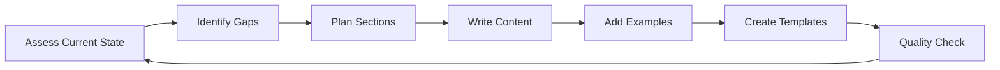

# BookLab2: Novel Development Framework

A comprehensive system for transforming book ideas into complete novels through structured progression and AI-assisted skill frameworks.

## 📚 Project Overview

BookLab2 is a novel development framework that uses a waterfall progression methodology combined with specialized AI skills to guide writers through the complete journey from concept to finished manuscript. The project focuses on a romantasy (romantic fantasy) novel featuring leprechaun mythology set in modern Ireland.

## 🎯 Core Concept

The system breaks down novel writing into manageable, progressive stages:
1. **Ideation** → Generating and refining the core concept
2. **World Building** → Creating the setting, magic system, and rules
3. **Character Development** → Designing compelling characters with authentic voices
4. **Plot Architecture** → Structuring the narrative arc and key beats
5. **Scene Construction** → Building individual scenes with proper pacing
6. **Prose Refinement** → Polishing style and voice consistency
7. **Revision Cycles** → Iterative improvement through multiple passes

## 🛠️ Skills System

### What Are Skills?

Skills are specialized knowledge modules stored in `.claude/skills/` that provide frameworks, templates, and guidance for specific aspects of novel development. Each skill is a comprehensive guide that Claude can use to help develop your novel.

### Current Skills Status

| Skill | Status | Lines | Description |
|-------|--------|-------|-------------|
| **`romantasy-story-architect`** | ✅ **COMPLETE** | 550+ | **META-SKILL**: Master coordinator showing how all skills work together, decision-making checklists, three-phase workflow (foundation→architecture→execution), chapter breakdown template, and integration guides |
| **`romantasy-scene-builder`** | ✅ **COMPLETE** | 450+ | Complete scene development framework with dialogue techniques, emotional arc mapping, scene flow, transitions, and comprehensive examples |
| **`character-voice-and-arc`** | ✅ **COMPLETE** | 550+ | Character development system with voice distinction techniques, arc tracking frameworks, emotional state mapping, and practice exercises |
| **`romantasy-prose-style`** | ✅ **COMPLETE** | 870+ | Comprehensive prose style guide with show vs tell, Irish/Celtic elements, sentence craft, sensual writing, love triangle prose techniques, and 15 practice exercises |
| **`leprechaun-realm-worldbuilding`** | 🟡 **IN PROGRESS** | 391 | World construction with leprechaun mythology, succession politics, character profiles, magic system rules, and plot tracking. Needs: expanded magic system details, more realm politics depth |
| **`romantasy-plot-brainstorming`** | 🟡 **IN PROGRESS** | 453 | Three-act structure, romance beat sheet, brainstorming techniques, subplot ideas, and pacing guides. Needs: more brainstorming techniques, expanded subplot examples |

#### Skill Details

**✅ COMPLETE SKILLS**

1. **`romantasy-story-architect`** (.claude/skills/romantasy-story-architect/SKILL.md) **[META-SKILL]**
   - Master coordinator for all other skills
   - Three-phase workflow: Foundation → Architecture → Execution
   - Decision-making checklists for worldbuilding and plot
   - Chapter breakdown template and creation guide
   - Skill integration strategies (how to use multiple skills together)
   - Session scripts for working with Claude
   - Common workflows for different stages
   - Revision consistency checklist

2. **`romantasy-scene-builder`** (.claude/skills/romantasy-scene-builder/SKILL.md)
   - Scene types and structures
   - Dialogue techniques with romantic tension
   - Emotional arc mapping within scenes
   - Scene-to-scene flow and transitions
   - Pacing and beats framework
   - Multiple example scenes with leprechaun/Irish mythology
   - Practice exercises and templates

3. **`character-voice-and-arc`** (.claude/skills/character-voice-and-arc/SKILL.md)
   - Voice distinction techniques for three main characters
   - Character arc tracking frameworks
   - Emotional state mapping and progression
   - Dialogue pattern differentiation
   - Internal monologue guidelines
   - Practice exercises for voice development
   - Arc transformation templates

4. **`romantasy-prose-style`** (.claude/skills/romantasy-prose-style/SKILL.md)
   - Narrative voice and POV guidance
   - Show vs tell techniques with romantasy examples
   - Irish & Celtic language integration (terms, pronunciations, cultural details)
   - Sentence-level craft (rhythm, flow, variety, punctuation)
   - Advanced sensual writing techniques (escalation ladder, heat levels, consent)
   - Writing the love triangle through prose
   - 15 comprehensive practice exercises

**🟡 IN PROGRESS SKILLS**

5. **`leprechaun-realm-worldbuilding`** (.claude/skills/leprechaun-realm-worldbuilding/SKILL.md)
   - **Current**: Succession law, noble houses, character profiles, vault/prophecy details, magic system basics, setting descriptions, key plot points
   - **Needs**: Expanded magic system mechanics, deeper realm politics/factions, more setting details, leprechaun cultural traditions, magical consequences framework

6. **`romantasy-plot-brainstorming`** (.claude/skills/romantasy-plot-brainstorming/SKILL.md)
   - **Current**: Three-act structure for love triangle, romance beat sheet, key plot questions, brainstorming techniques, subplot ideas, pacing guide
   - **Needs**: More advanced brainstorming methods, chapter-by-chapter breakdown examples, expanded subplot integration, tension tracking tools

### How to Use Skills

1. **Request Skill Activation**: Ask Claude to use a specific skill for your current task
2. **Apply Frameworks**: Use the templates and checklists provided
3. **Iterate and Refine**: Skills are living documents that improve with use
4. **Extend as Needed**: Add new sections based on emerging needs

## 🔄 Development Workflow

### Working with Claude on This Project

1. **Start with Context**: Claude reads the CLAUDE.md file for project-specific guidance
2. **Use Todo Lists**: Claude tracks tasks using the TodoWrite tool for visibility
3. **Iterative Development**: Build skills incrementally, adding depth over time
4. **Example-Driven**: Every concept includes concrete examples from the story

### Skill Development Process



### Best Practices

- **Progressive Enhancement**: Start simple, add complexity
- **Practical Focus**: Every section must be immediately applicable
- **Consistency**: Maintain tone and format across all skills
- **Story Integration**: Examples should fit the romantasy leprechaun theme

## 📖 The Story Context

### Setting
Modern Ireland with hidden leprechaun realms

### Main Characters
- **Protagonist**: Estate appraiser who discovers magic
- **The Uncle**: Older leprechaun, estate owner, controlled power
- **The Nephew**: Younger leprechaun, wild energy, playful nature

### Core Conflict
Love triangle with magical politics and realm succession stakes

## 🚀 Getting Started

1. **Review Existing Skills**:
   ```bash
   tree .claude/skills -a
   ```

2. **Read a Skill**:
   Ask Claude to review a specific skill for you

3. **Apply a Framework**:
   Use skill templates for your current writing task

4. **Extend Skills**:
   Ask Claude to add new sections based on your needs

## 💡 Ideation Guidelines

### When Developing New Content

1. **Start with "What If?"**: Generate multiple possibilities
2. **Layer Complexity**: Build from simple to complex
3. **Consider Consequences**: Every choice has ripple effects
4. **Maintain Consistency**: Align with established world rules
5. **Emotional Truth**: Even fantasy needs emotional authenticity

### Iteration Process

- **First Pass**: Get ideas down, don't perfect
- **Second Pass**: Structure and organize
- **Third Pass**: Add depth and nuance
- **Fourth Pass**: Polish and refine
- **Final Pass**: Consistency check

## 📊 Project Structure

```
booklab2/
├── .claude/
│   ├── skills/           # AI skill modules
│   │   ├── character-voice-and-arc/
│   │   ├── leprechaun-realm-worldbuilding/
│   │   ├── romantasy-plot-brainstorming/
│   │   ├── romantasy-prose-style/
│   │   └── romantasy-scene-builder/
│   │       └── SKILL.md  # Comprehensive scene building guide
│   └── settings.local.json
├── CLAUDE.md            # AI assistance guidelines
└── README.md           # This file
```

## 🔮 What's Left to Complete

### Priority 1: Complete In-Progress Skills

**`leprechaun-realm-worldbuilding`** needs:
- [ ] Expanded magic system mechanics (how powers work, costs, limitations)
- [ ] Deeper realm politics and faction details
- [ ] More comprehensive setting descriptions (rooms, locations, landmarks)
- [ ] Leprechaun cultural traditions and customs
- [ ] Magical consequences framework (what happens when rules are broken)
- [ ] More examples of magical interactions

**`romantasy-plot-brainstorming`** needs:
- [ ] Additional brainstorming techniques and prompts
- [ ] Chapter-by-chapter breakdown template/example
- [ ] Expanded subplot integration strategies
- [ ] Tension tracking tools and frameworks
- [ ] More "what if" scenario generators
- [ ] Plot problem-solving techniques

### Priority 2: Schema & Waterfall System

- [ ] Design schema for waterfall progression tracking
- [ ] Define stages from concept to manuscript
- [ ] Create validation criteria for each stage
- [ ] Build transition checkpoints between stages
- [ ] Develop progress tracking mechanism

### Priority 3: Integration & Workflow

- [ ] Skill integration system (how skills work together)
- [ ] Cross-skill consistency checking
- [ ] Version control for manuscript iterations
- [ ] Automated consistency validation tools

### Priority 4: Future Skills (Lower Priority)

- `revision-strategies`: Structured editing approaches
- `beta-reader-integration`: Feedback incorporation methods
- `publishing-preparation`: Final manuscript preparation
- `chapter-drafting`: Chapter-level writing framework
- `arc-tracking`: Multi-book series planning

## 🤝 Contributing

When adding to this project:
1. Maintain the established skill structure
2. Include comprehensive examples
3. Document new patterns in CLAUDE.md
4. Keep the romantasy leprechaun theme consistent
5. Use Claude's TodoWrite tool to track progress

## 📝 Version History

- **v0.4**: Created romantasy-story-architect meta-skill (550+ lines) - master coordinator with decision checklists, three-phase workflow, chapter breakdown template, and skill integration guide
- **v0.3**: Completed romantasy-prose-style skill (870+ lines), comprehensive status tracking, detailed roadmap of remaining work
- **v0.2**: Added comprehensive skill development workflow and ideation guidelines
- **v0.1**: Initial project setup with base skills structure

## 📊 Current Project Statistics

- **Total Skills**: 6
- **Complete Skills**: 4 (romantasy-story-architect, romantasy-scene-builder, character-voice-and-arc, romantasy-prose-style)
- **In Progress Skills**: 2 (leprechaun-realm-worldbuilding, romantasy-plot-brainstorming)
- **Total Documentation**: 3,200+ lines across all skills
- **Completion**: ~67% of core skill development

---

*Built with Claude Code for AI-assisted novel development*